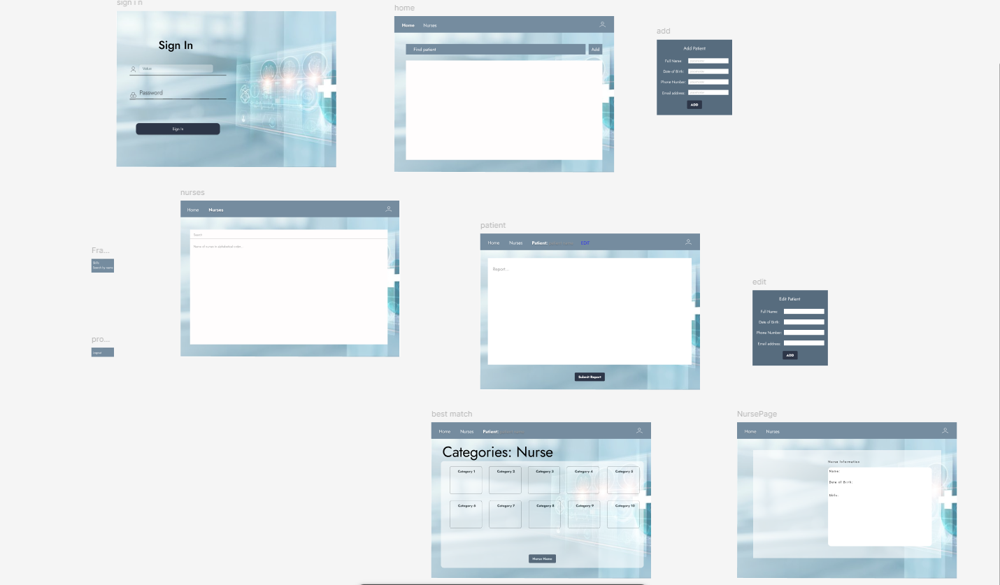
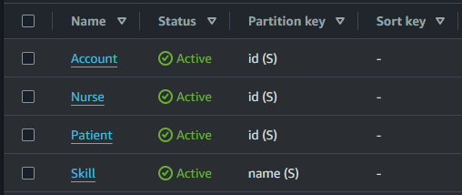
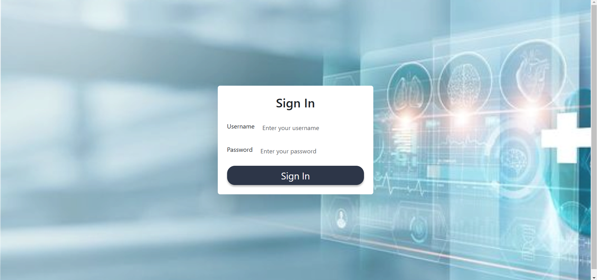
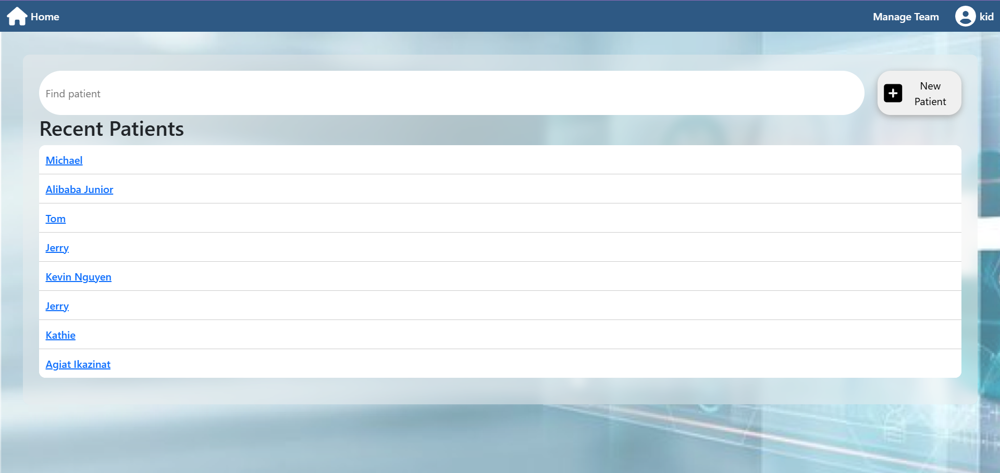
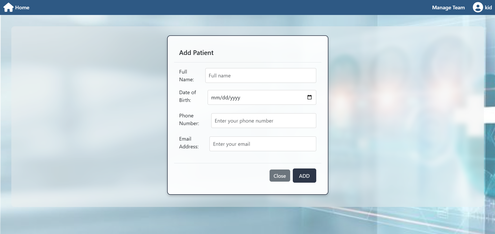
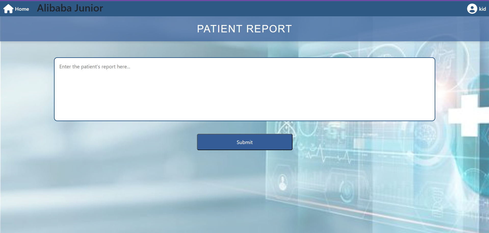

# MediVersed


An Automated Patient-Nurse Matching System for Optimal Healthcare Outcomes

[View on Devpost](https://devpost.com/software/mediversed)


---

## 📖 Inspiration
In healthcare, time and resources are often stretched thin, leading to potential burnout for professionals and, ultimately, to decreased quality of care for patients. **MediVersed** was inspired by the need to streamline and improve the nurse-patient assignment process. By automating this workflow, MediVersed reduces human error and bias, helping healthcare providers deliver faster, more personalized, and fairer assignments. This improves patient satisfaction, nurse morale, and leads to better patient outcomes.

## 💡 What It Does
**MediVersed** is a web-based platform that matches patients with nurses based on specific care requirements and nurse expertise. Here's how it transforms the assignment process:

- **Patient-Centered Matching**: Matches patients with nurses who are most suited to handle their specific needs.
- **Automation**: Automates the assignment process, minimizing human error and reducing bias.
- **Scalability**: Adapts quickly to increasing data loads, ensuring that assignments remain efficient and precise.
- **Enhanced Satisfaction**: Improves patient satisfaction by delivering better care and supports healthcare staff by balancing workloads.

---

## 🛠️ How We Built It
MediVersed combines several cutting-edge technologies to create a seamless and reliable platform:

### **Frontend**
- **Figma**: The user interface was designed in Figma.
- **React and Vite**: The user interface was transformed into a responsive, accessible, and user-friendly React application.
  
### **Backend**
- **Express.js**: An Express server serves as the backbone for data processing, routing, and authentication.
  
### **Database**
- **AWS DynamoDB**: Scalable and secure data storage solution, handling both patient and nurse data reliably.
  
### **Artificial Intelligence**
- **OpenAI gpt-4o model**: Analyzes patient's report to match them accurately with nurses, factoring in skills, experience, and workload.

---

## 🧩 Key Features

1. **AI-Powered Matching Algorithm**: Automatically assigns nurses to patients based on care needs and nurse skill profiles.
2. **Secure & Scalable Data Management**: Uses AWS DynamoDB to store patient and nurse information safely and efficiently.
3. **Responsive UI**: Built with React, the platform offers a smooth and intuitive user experience, accessible on various devices.
4. **Automated Authentication**: Utilizes secure cookie transfers and JSON Web Tokens (JWT) to ensure data integrity and secure access.

## 🚀 Getting Started

### Prerequisites
- **Node.js**
- **AWS Account** for DynamoDB
- **OpenAI API** for AI model access

### Setup

1. **Clone the Repository**:
    ```bash
    git clone https://github.com/yourusername/Mediversed.git
    cd Mediversed
    ```

2. **Install Dependencies**:
    ```bash
    # Install dashboard dependencies
    cd dashboard
    npm install

    # Install server dependencies
    cd ../server
    npm install
    ```

3. **Configure Environment Variables**: Create a `.env` file in the root of each folder with the following:
    # Dashboard (.env)
    ```.env
    NODE_ENV=development
    ```

    # Server (.env)
    ```.env
    # for AWS DynamoDB
    ACCESS_KEY_ID=
    SECRET_ACCESS_KEY=

    # for JWT
    JWT_SECRET_KEY=

    # for bcrypt
    SALT_ROUNDS=

    # for OpenAI
    OPENAI_API_KEY=
    ```

4. **Run the Application**:
    ```bash
    # Run the dashboard
    cd dashboard
    npm run dev

    # Run the server
    cd ../server
    npm start
    ```

5. **Access MediVersed**: Open your browser and navigate to `http://localhost:5178` and your server will be running on `http://localhost:9897`.


---

## 🖥️ Tech Stack

- **Frontend**: React, Vite, Figma for initial design
- **Backend**: Express.js
- **Database**: AWS DynamoDB
- **AI**: OpenAI for NLP-based patient-nurse matching

---

## 📸 Screenshots & Demo

### Design Prototype

<div align="center">
  
<a href="https://www.figma.com/design/imLQkINAwPxOpcuDoT1Ccj/Hospital-App?node-id=0-1&t=A2VFKCklu1Z4qNPL-1">
  
  

  View Full Design in Figma
  
</a>
</div>

### Database Schema
<div align="center">
  

</div>

### Application Screenshots
<div align="center">

  
  <p><em>Sign In Interface</em></p>

  
  <p><em>Main Dashboard Interface</em></p>
  
  
  <p><em>Register Patient Interface</em></p>

  
  <p><em>Patient New Report</em></p>

</div>

### Demo Video
<div align="center">
  
[](https://youtu.be/SxxhHgZjC4U)
</div>
<p align="center"><em>Click the image above to watch the demo video</em></p>

---
<h2 align="center"> Tools We Have Used and Learned In This Project</h2>
<p align="center">


</p>

---


## 📜 License
This project is licensed under the MIT License - see the [LICENSE](LICENSE) file for details.

